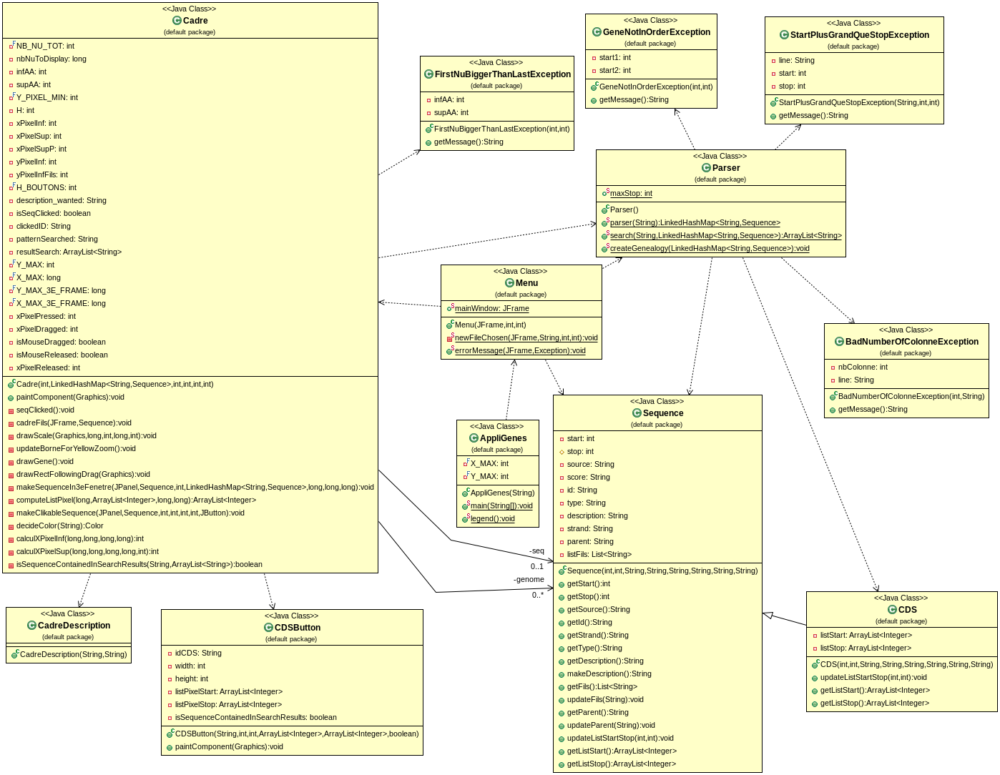

# GeneBrowser_Java_M1
A project done in M1, this a gene browser for gff3 files, tested with java version "1.8.0_181"

<h3>While in this directory:</h3>

<b>command to create the documentation</b>:       

                       javadoc -encoding "UTF-8" src/*.java -d docs

<b>commands to launch the application</b>: 

                       mkdir class
                       javac -encoding "UTF-8" src/*.java -d class && java -cp class AppliGenes
                       
<strong>src/testing_files</strong> regroup different gff3 files for testing the application

### Functionalities:

#### Display
     * individual genes by opening a gff3 file (src/testing_files)
     * description of a gene by clicking on it
     * products of a gene by clicking on it

#### Zoom
      * Using the "+" and "-" buttons
      * By entering a specific range at the bottom left
      * By drawing a yellow rectangle (click, hold , move right then release)

#### Pattern search
      * The pattern has to be entered at the bottom right, 
      the sequences whose description match the pattern will be highlighted in yellow 

### UML Diagram

